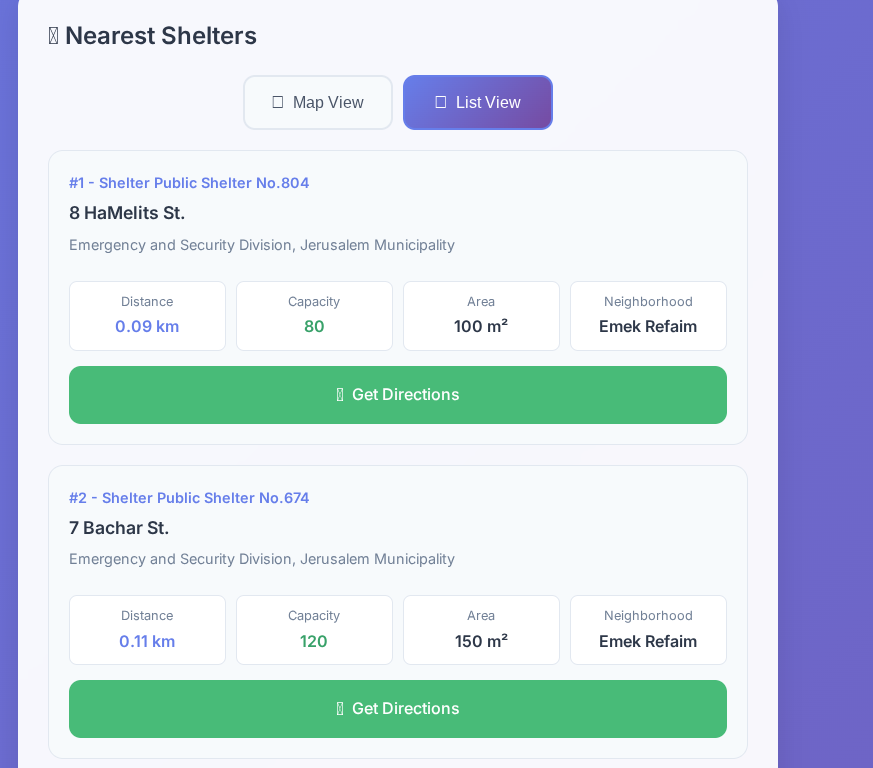

# Jerusalem Shelter Locator

A responsive web application for finding the nearest emergency shelters in Jerusalem based on user location.

## Important Disclaimer

This application is not a substitute for official emergency information and should not be relied upon as the sole source for emergency shelter locations. The data used in this application was imported from the Jerusalem Municipality website on September 19th, 2025.**

**For the most current and official emergency information, always consult official government sources and emergency services.**

## Screenshots

## 📊 Data Source

The shelter data is sourced from the Jerusalem Municipality website and includes:
- Shelter locations with precise coordinates
- Capacity information
- Operating organizations
- Address details
- Navigation links

## 🚀 Deployment

The application is deployed at: [shelterfinder.bydanielrosehill.com](https://shelterfinder.bydanielrosehill.com)
